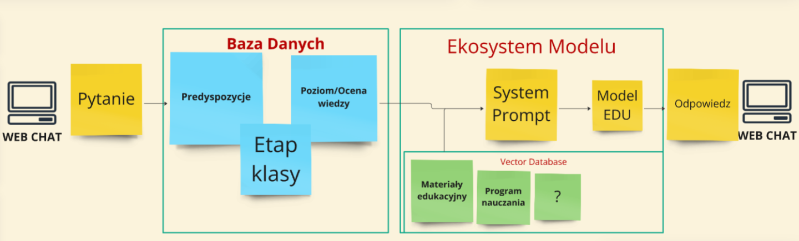

Ciekawe zagadnienie, to prawda, że sporym problemem może być halucynacja, dlatego tutaj Polska mogła by sie wykazać i zostać pionerem jeśli chodzi o model edukacyjny

Odpowiednio przygotowany DataSet z instrukcjami skupionymi na edukacje + przygotowanie bazy embeddingowej z wszystkimi materiałami edukacyjnymi mogło by pomóc wyeliminowac ofc nie całkowicie halucynacje
Widziałbym to tak:

- ** Dataset Edu ** - specjalny dataset dla edukacji, dzięki któremu model odpowiadał by w wytrenowany sposób jako pedagog, skupiał się na edukacji dla dzieci i młodzieży

- **Bielik Edu** - wytrenowany na specjalnym datasecie przygotowanym przez ekspertów z Ministerstwa Edukacji
musiałby przekazywać wiedze, i zachęcać młodego człowieka do czytania tych wypociń, bo czasami jak CzatGPT pojedzie tym swoim akademickim tonem :D
Do tego musiałby być mocno moderowany i odpowiedni dla dzieci i młodzieży

- **Baza wiedzy**(embedding + sematic search) stworzona z materiałow edukacyjnych jako źródło do RAG - ciągle aktualizowana co mogło by odciążyć aktualizowanie datasetu i ponowne kosztowne trenowanie modelu

**Baza pamieci Cache** - pewne pytania napewno będą sie powtarzać w procesie edukacji, czemu by nie stworzyć biblioteki gotowych pytań i odpowiedzi

**Szablon predyspozycji ucznia** - Ministerstwo wraz z ekspertami pedagogami mogło by przygotować gotowe szablony testów, które by sprawdzały za pomocą czatu z Modelem w jaki sposób dany uczeń uczy się najlepiej, 
- metadane z takiego testu można by wykorzystać jako SystemPrompt

** Agent Progresu ** - to o czym Domi wspominał, oprócz predyspozycji ucznia, można by przechowywać i uaktualniać na jakim obecnie poziomie jest uczeń + z czym radzi sobie gorzej, dzięki czemu czat mógłby 
nakierowywać pytania na podniesienie wiedzy z konkretnego zagadnienia - i tutaj znów ministerstwo mogło by sie wykazać i stworzyć oficjalne zunifikowane progi wiedzy na podstawie programu nauczania, wtedy to już 
prosta ścieżka w profilu ucznia przypisujemy mu punkty/ocene

